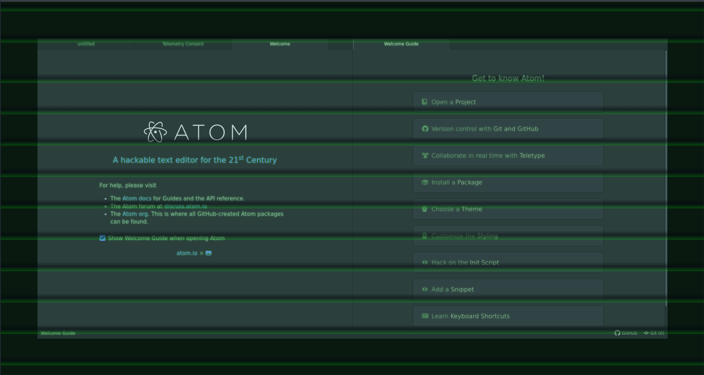
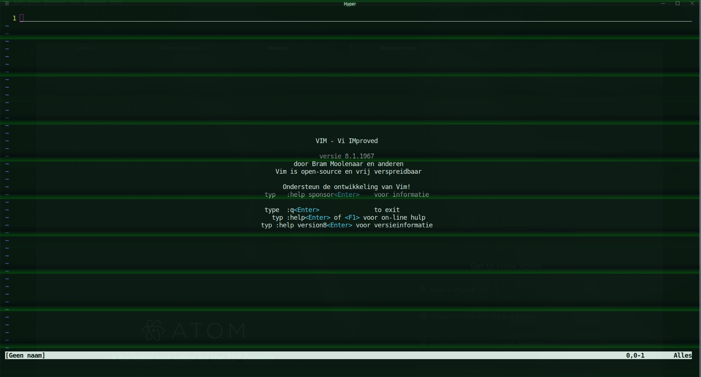

I made css based retrace lines for fun and
a retro look and feel.

This folder is contains the code of that endevour.
It mirros my home folder for the relevant files.

# Atom
Then I put it in atom (electron based terminal).

# Hyper

Then I put it in Hyper (electron based terminal).

# Conclusion
Now life is good.

